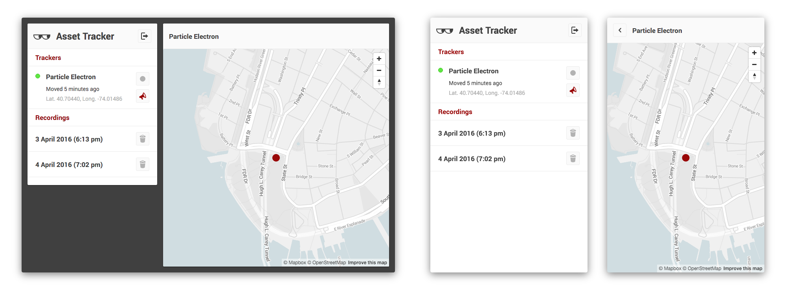

An asset tracker app for the [Particle Electron](https://www.particle.io), made
with [Meteor](https://www.meteor.com). The project includes an Electron
firmware and a mobile-friendly web app that shows the locations of your assets
on a map. Get notified via SMS when an asset is moved and watch/record the
route that it's taking in real time!

## Screenshots

[](readme/screenshots.png)

## Setup

In order to deploy and use the application, you need:

* Particle Electron [Asset Tracker Kit](https://store.particle.io)
* Server capable of running Meteor or a Galaxy subscription and MongoDB
* Twilio account (a free trial account should be sufficient)
* Mapbox account (also free)

### Mapbox

The map component is provided by [Mapbox](https://www.mapbox.com). You can
create your own style in Mapbox Studio or import the custom style of this
project from _mapbox/style.json_ into your Mapbox account.

### Configuration

There are two configuration files that you have to extend with your own account
data and tokens.

__app/imports/mapbox.js__:

```js
export const Mapbox = {
  accessToken: '<access token>',
  styleUrl: 'mapbox://styles/<username>/<style>'
};
```

__app/imports/secrets.js__:

```js
export const Secrets = {
  Particle: {
    username: '<email>',
    password: '<password>'
  },

  Twilio: {
    accountSid: '<account SID>',
    authToken: '<auth token>',
    from: '<sender phone number>'
  }
};
```

### Users

To create user accounts, add the required information to
_app/private/users.json_. The server reads this file when it starts and adds
the accounts. Alarm messages are sent to the phone number that you specify
here. Note that you can only send to verified numbers if you are using a Twilio
 trial account.

```json
{
  "<email>": {
    "password": "<password>",
    "phone": "<phone number>"
  }
}
```

### Trackers

Trackers are imported from _app/private/trackers.json_ on server startup.

```json
{
  "<email>": [
    {
      "particleId": "<Electron device ID>",
      "name": "<display name>"
    }
  ]
}
```

### Sprite sheets

Sprite sheets for standard and retina resolutions are generated from images in
the _assets_ folder using Gulp.

```
cd tools
npm install
cd sprite
gulp
```

## License

Copyright © Christian Klaussner  
License: GPLv3

Entypo pictograms by Daniel Bruce — [www.entypo.com](http://www.entypo.com)
